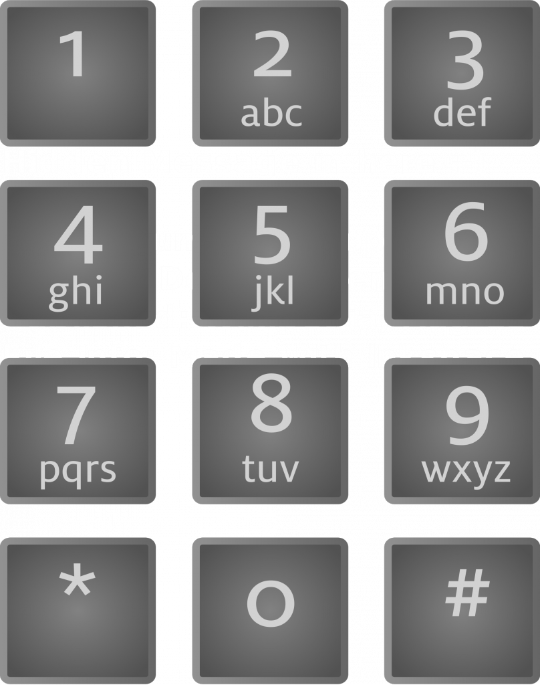

# Stéganographie

---
## Gunnm

https://www.root-me.org/fr/Challenges/Steganographie/Gunnm

Le mot de passe est caché sur le dessin, pas besoin de chercher plus loin.

---
## Pas très carré

https://www.root-me.org/fr/Challenges/Steganographie/Pas-tres-carre

Il suffit de télécharger l'image et de l'ouvrir avec un éditeur de texte, le mot de passe est caché dedans.

---
## Point à la ligne

https://www.root-me.org/fr/Challenges/Steganographie/Point-a-la-ligne

#### Analyse de l’épreuve

Tout d’abord, en lisant le titre et l’énoncé, on se doute bien que l’épreuve va tourner autour d’une histoire de point. En ouvrant l’image du challenge, on peut s’apercevoir effectivement qu’il y a des points un peu partout, sans pour autant respecter la syntaxe des phrases. On peut remarquer aussi un petit (gros) détail, les points sont présents dans tout le texte sauf sans la première ligne.

#### Explication

On commence alors à jouer avec les points, regarder si ceux-ci ne représentent pas une forme entre eux, si les lettres avant/après les points pouvaient donner quelque chose... Et c’est la que le détail ci-dessus devient important. On a essayé de regarder avant les points, après les points, mais étant donné qu’il n’y a rien seulement sur la première ligne, on pourrait essayer de regarder au dessus des points.  

---
## Stéganomobile

https://www.root-me.org/fr/Challenges/Steganographie/Steganomobile

La solution m'a sauté aux yeux de suite, j'ai immédiatement pensé que cela correspont aux touches des vieux téléphones mobiles et qu'ils s'agissaient donc d'un message. Il suffit donc juste de faire correspondre les chiffres aux lettres correspondantes. Ce la se nomme la saisie T9.  

---
## Twitter Secret Messages

https://www.root-me.org/fr/Challenges/Steganographie/Twitter-Secret-Messages

Pour ce challenge, rendez-vous sur un site pour décrypter des messages cachés Tweeter et coller le tweet dedans. Cela vous donnera le mot de passe.